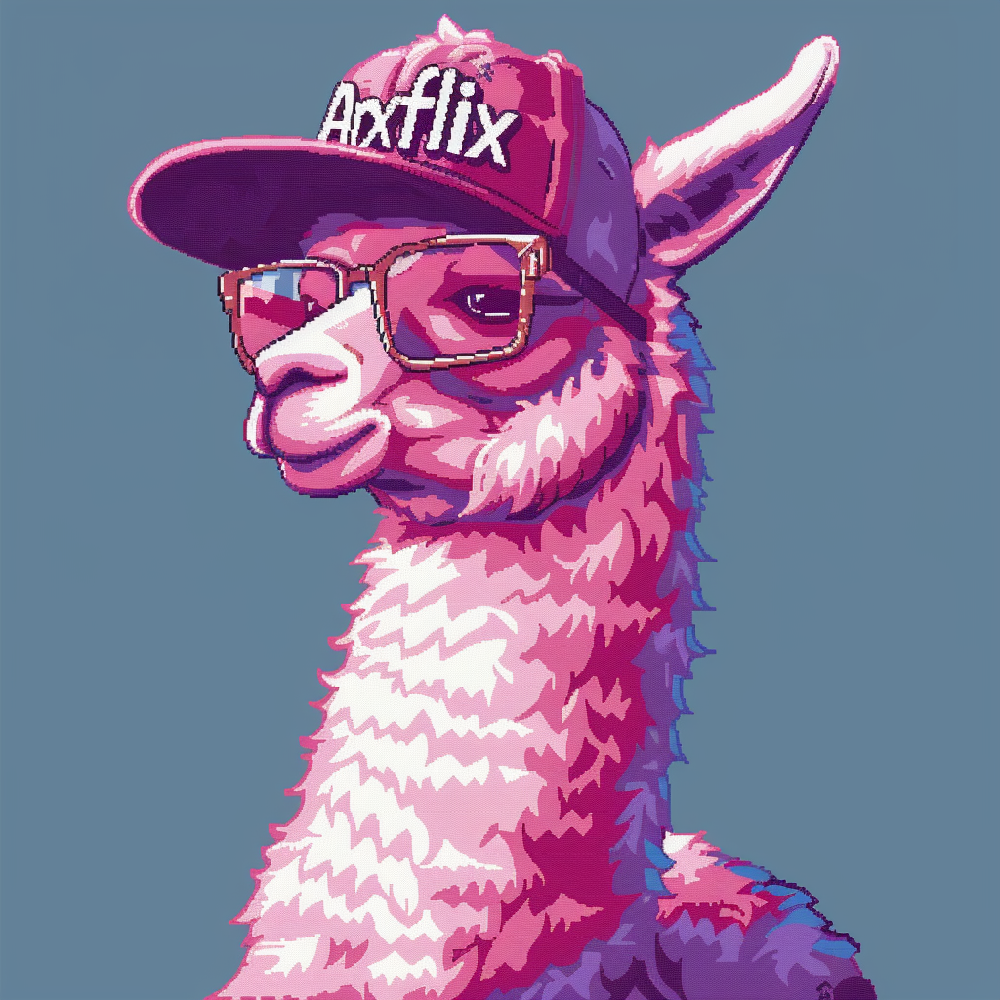

# ArXFlix

[](https://www.youtube.com/@Arxflix)
[](https://x.com/arxflix)

ArXFlix is a powerful tool that automatically transforms research papers from ArXiv into engaging two-minute video summaries. It leverages advanced AI models to extract key information, generate concise scripts, synthesize audio, and produce visually appealing videos complete with subtitles and rich content.

## Features

-   **Automated Paper Summarization:**
    -   Fetches paper content from ArXiv using either `arxiv_gpt` or `arxiv_html` methods.
    -   Supports raw PDF ingestion using MarkThat OCR (OCR, figure extraction).
    -   Generates concise summaries using AI models like OpenAI, Gemini, OpenRouter, or local models.
-   **Script Generation:**
    -   Creates engaging video scripts tailored for a two-minute format.
    -   Supports multiple script generation methods: `openai`, `local`, and `gemini`, `openrouter`.
-   **Audio Synthesis:**
    -   Converts scripts into natural-sounding audio using either `elevenlabs` or `lmnt` text-to-speech services.
-   **Video Generation:**
    -   Combines generated audio, subtitles (SRT), and rich content (JSON) to create a complete video.
    -   Uses FFmpeg for video processing.
-   **Flexible API:**
    -   Provides a FastAPI backend with endpoints for each stage of the video generation pipeline.
    -   Allows customization of AI models, audio services, and output formats.
-   **User-Friendly Frontend:**
    -   Offers a React-based frontend built with Next.js and Tailwind CSS.
    -   Provides an intuitive interface for users to input ArXiv paper IDs and generate videos.
-   **Gradio Demo:**
    -   Includes a Gradio demo (`arxflix_gradio.py`) for easy experimentation and sharing.

## Example Videos

[](https://youtu.be/FqGK-FDztgg)
[](https://youtu.be/umc-jUMqrmE)
[](https://youtu.be/1HptxaIGywk)

## Quickstart

ArXFlix ships with a Makefile to standardize installation and running across macOS, Linux/PC, and Docker.

1) Create a `.env` file in the repository root with your API keys (see Environment below).

2) Install and run (auto-detects OS):

```bash
make install
make run
```

This installs backend and frontend requirements as needed and launches the Gradio app at `http://localhost:7860`.

### Make targets

- `make install`: Auto-detect OS; install dependencies.
- `make run`: Auto-detect OS; run the Gradio app.
- `make mac-gradio`: macOS install (uses `backend/requirements.txt`) + run.
- `make pc-gradio`: Linux/PC install (uses `requirements-docker.txt`) + run.
- `make gradio`: Run Gradio assuming deps already installed.
- `make gradio-docker`: Build and run the Docker image (exposes port 7860). Supports `ENV_FILE=.env` and `PORT=7860` overrides.

Notes:
- The frontend Next.js server is not required to run; we only install frontend dependencies because the video renderer (Remotion CLI) uses the frontend bundle under the hood.
- On first render, Remotion downloads a Chromium Headless Shell.

### Docker

```bash
make gradio-docker
# or manual
docker build -t arxflix .
docker run --rm -it -p 7860:7860 --env-file .env -v "$(pwd)/generated_videos:/app/generated_videos" arxflix
```

### Environment

Place a `.env` file at the repository root. Common variables
For the moment OpenRouter is used as provider for all models.
(So we use OpenRouter to be sure everything goes well)
:

```
# LLMs
OPENROUTER_API_KEY=
OPENAI_API_KEY=
GEMINI_API_KEY=
GROQ_API_KEY=


# Audio providers (optional depending on your selection)
ELEVENLABS_API_KEY=
LMNT_API_KEY=
DEEPGRAM_API_KEY=

# Optional OCR / PDF parsing (if you use PDF mode)
OCR_MODEL=google/gemini-2.0-flash-001
OCR_PROVIDER=openrouter
OCR_COORDINATE_EXTRACTOR_MODEL=google/gemini-2.0-flash-001
OCR_PARSING_MODEL=google/gemini-2.5-flash-lite
OCR_FIGURE_DETECTOR_MODEL=openai/gpt-5-mini
SCRIPGENETOR_MODEL=google/gemini-2.5-pro
```

### Linux dependencies for video rendering

If you run outside Docker on Linux and the render fails with missing libraries (e.g. `libnss3.so`), install:

```bash
sudo apt-get update && sudo apt-get install -y \
  ffmpeg libsndfile1 libnss3 libnspr4 libxss1 libasound2 libatk1.0-0 \
  libatk-bridge2.0-0 libcups2 libdrm2 libgbm1 libxkbcommon0 libxcomposite1 \
  libxdamage1 libxrandr2 libatspi2.0-0 libgtk-3-0 libx11-6 libx11-xcb1 \
  libxcb1 libxext6 libxfixes3 libpangocairo-1.0-0 libpango-1.0-0 libcairo2 \
  libfontconfig1 fonts-liberation fonts-dejavu-core
```

Docker images already include these.

### Raw PDF processing (MarkThat)

ArXFlix can process a raw PDF directly using [MarkThat](https://pypi.org/project/markthat/). This performs OCR, extracts figures, and produces enriched markdown suitable for the pipeline.

Setup:
- Ensure these environment variables are set (see `.env` template above):
  - `OPENROUTER_API_KEY` (required — MarkThat uses OpenRouter for models)
  - `OCR_PROVIDER` (e.g., `openrouter`)
  - `OCR_MODEL`, `OCR_COORDINATE_EXTRACTOR_MODEL`, `OCR_PARSING_MODEL`, `OCR_FIGURE_DETECTOR_MODEL`

Using Gradio:
- Choose “Upload PDF” in the UI, drop your `.pdf`. The app will automatically use the `pdf` method.

Using the API directly:
```bash
curl -G "http://localhost:8000/generate_paper/" \
  --data-urlencode "method=pdf" \
  --data-urlencode "paper_id=paper_id" \
  --data-urlencode "pdf_path=/absolute/path/to/paper.pdf"
```

Notes for Docker/API:
- If calling the API with a local `pdf_path`, mount the file into the container and pass the in-container path, e.g.:
  ```bash
  docker run --rm -p 7860:7860 \
    --env-file .env \
    -v "$(pwd)/my-pdfs:/data" \
    arxflix
  # then call the API with pdf_path=/data/your.pdf
  ```
  Uploading via the Gradio UI does not require a volume; the file is uploaded to a temp path inside the container.

## API Usage Examples

You can also interact with the FastAPI backend directly. Start it separately, then hit endpoints:

```bash
# From repo root
uvicorn backend.main:api --reload
# Or from backend/ directory
cd backend && uvicorn main:api --reload
```

### Generate Paper Markdown

```bash
curl -X GET "http://localhost:8000/generate_paper/?method=arxiv_html&paper_id=2404.02905"
```

### Generate Script

```bash
curl -X POST "http://localhost:8000/generate_script/?method=openai&paper_id=2404.02905&paper_markdown=<PAPER_MARKDOWN>" -H "Content-Type: application/json"
```

### Generate Assets (Audio, SRT, JSON)

```bash
curl -X POST "http://localhost:8000/generate_assets/?method=elevenlabs&script=<SCRIPT>" -H "Content-Type: application/json"
```

### Generate Video

```bash
curl -X POST "http://localhost:8000/generate_video/?input_dir=<INPUT_DIR>&output_video=output.mp4" -H "Content-Type: application/json"
```

**Note:** Replace placeholders like `<PAPER_MARKDOWN>`, `<SCRIPT>`, and `<INPUT_DIR>` with actual values.

When using the Gradio app (recommended), these steps run automatically for you.

## Configuration

- **API Keys:** Use a `.env` at the repository root (see Environment above).
- **Customization:** You can adjust prompts, audio settings, and video rendering parameters in `backend/utils/*`.

## Contributing

Contributions are highly encouraged! Please follow these steps:

1. Fork the repository.
2. Create a new branch: `git checkout -b feature/your-feature-name`
3. Make your changes and commit them: `git commit -m "Add your feature"`
4. Push to the branch: `git push origin feature/your-feature-name`
5. Open a pull request against the `main` branch.

Please ensure your code follows the project's coding style and includes appropriate documentation.

## Star History

[](https://star-history.com/#julien-blanchon/arxflix&Date)

## License

This project is licensed under the [MIT License](LICENSE) - see the [LICENSE](LICENSE) file for details. Note that some components may have their own licenses (e.g., Remotion).
